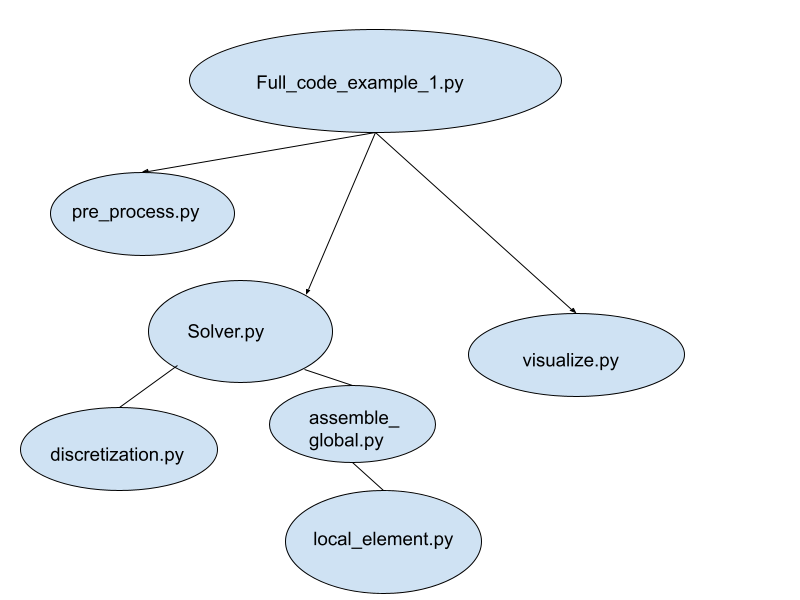

## Overview of FEA Code

### Code Overview

Execution of code is performed via full_code_example_1.py.
This code executes the remaining files in the following structure.

1. pre_proces.py generates the mesh using either triangular (D2_nn3_tri) or quadrilateral (D2_nn4_quad) elements. This file returns node coordinates and element connections. 

2. solver.py executes the analysis part of the code. Solver.py applies the boundary conditions and solves using the following subscripts:

    2a. discretization.py determines shape functions and derivatives; determines gauss point locations
   
    2b. assemble_global.py loops over all elements, calls local_element.py
   
    2c. local_element.py determines internal forces and distributes loads. 

4. visualize.py performs the post-processing aspects of the code. Displaying meshes and visualizing displacement magnitudes. This script generates 2D_meshs and gifs. 

### Comments
    Duplication between some scripts makes it confusing to follow functionality. For instance, the function name plot_mesh_2D is used both under visualize.py and pre_process_demo_helper.py. These functions are close but have minor differences. 
